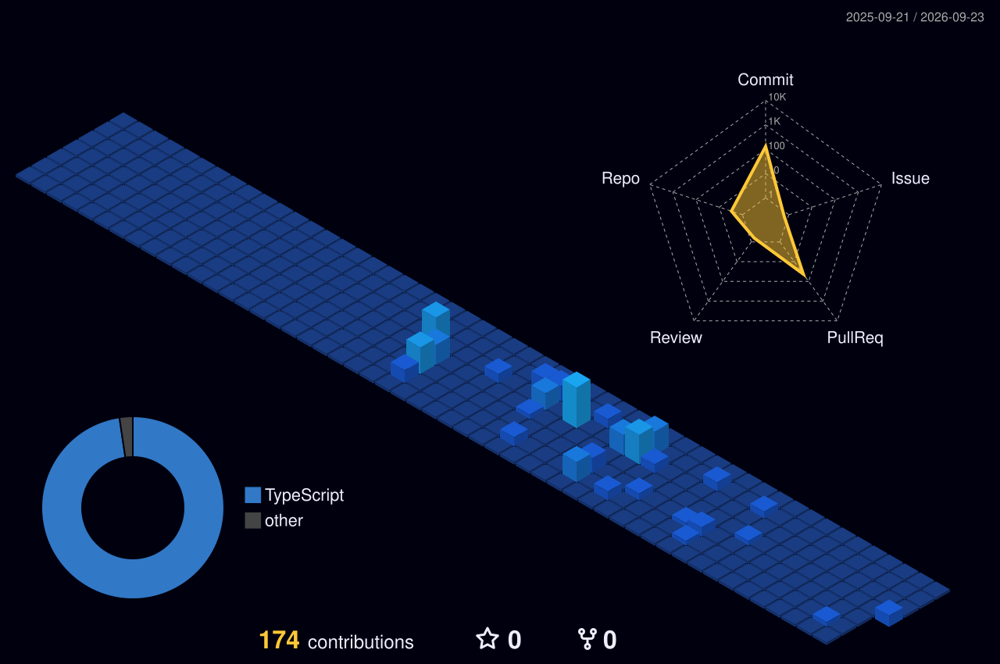

 

  

 

## 🛠️ Tech Stack & Tooling

  

 

## 🧊 3D Contribution Graph

  <picture>
    <source media="(prefers-color-scheme: dark)" srcset="./profile-3d-contrib/profile-night-view.svg">
    <source media="(prefers-color-scheme: light)" srcset="./profile-3d-contrib/profile-green-animate.svg">
    
  </picture>

 

## 🐍 Contribution Snake

  <picture>
    <source media="(prefers-color-scheme: dark)" srcset="./dist/github-contribution-grid-snake-dark.svg">
    <source media="(prefers-color-scheme: light)" srcset="./dist/github-contribution-grid-snake.svg">
    
  </picture>

 

## 📈 Activity & Metrics

  
  

  

 

  Solid foundations, clean code, and resilient architectures.

